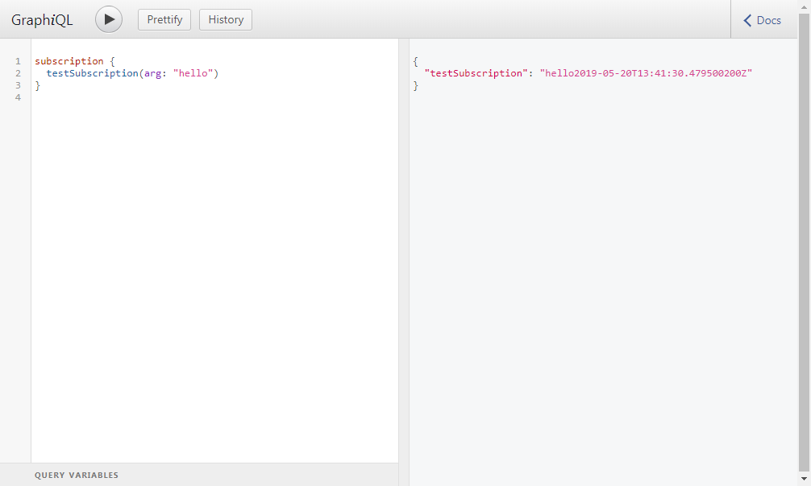

# GraphQL Subscription Example

This project is a simple example for a GraphQL subscription implementation.
It uses reactive streams publisher that emit 0 to N values - a so called flux. The flux is populated with values by starting a timer that ticks every 2 seconds and emits a string containing the current timestamp.

To test the subscription start this Spring Boot application and open http://localhost:8080/graphiql in your browser.
The subscription can be called like this:
```
subscription {
  testSubscription(arg: "hello")
}
``` 

In results window will show "hello"+current timestamp which is updated every 2 seconds:


